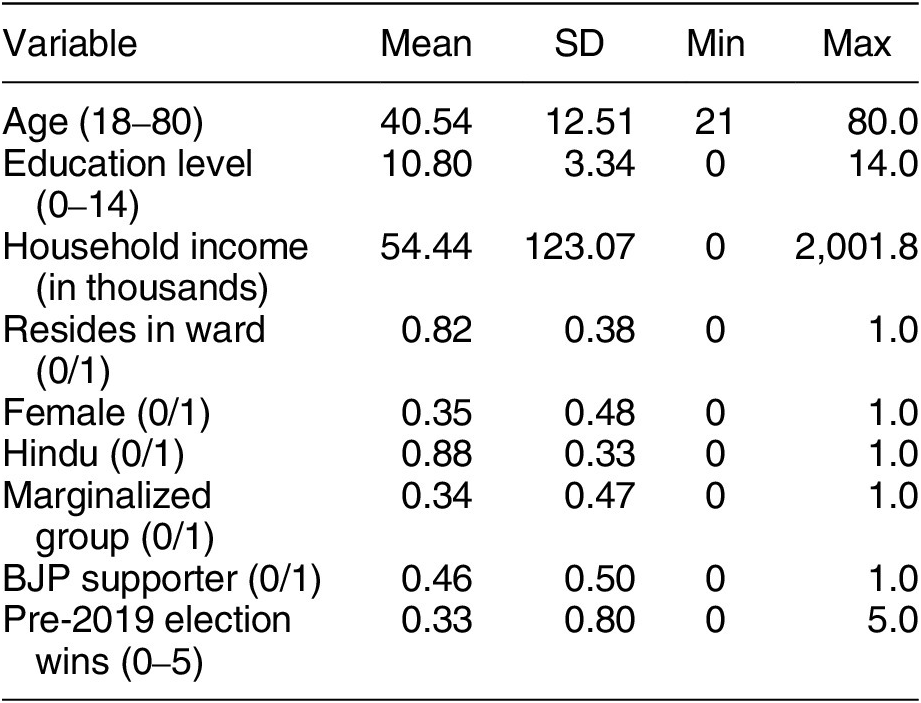

この記事では、計量分析を行う論文では必ず出現する「記述統計量 / 要約統計量」の表の読み方を解説します。同時に、政治学の計量分析で使われる事が多い変数の種類についても解説します。

:::{.callout-note collapse="true" title="参考文献"}
このページの内容をより詳しく知りたい方は、次の文献を読むことをおすすめします。

- 西山ほか『計量経済学』(有斐閣) の第2章 (特に Section 1)
- 浅野&矢内『Rによる計量政治学』(オーム社)の第6章
:::

## 記述統計とはなにか
データを使った分析を行うとき、分析者がすべてのデータを1つずつ確認することはあまりありません。
大量の観察を用意して、平均的な傾向を掴むというデータ分析のアプローチにおいて、このことは自然なこととも言えます。
しかし、全くデータの中身を見ないことには次のような問題が生じます。
すなわち、(1) 異常な値を取るデータが含まれていることに気付けない、(2) データを見るだけで得られる重要な示唆に気付けない、(3) 自身が思っている形式と違うデータになっているなどの問題です。

また読者の視点からして、データが全く公開されていない場合は次のことを疑うべきです。
例えば、捏造されたり都合よく切り取られたりしたデータかもしれないということです。

以上のような問題を解消する最もシンプルな方法は、分析者が全データをすべて確認したうえでそれを公開し、読者が同じくすべて確認することです。
しかし、それは現実的ではありません[^data]。
そこで、分析に使ったデータ (標本) の代表的な値を提示することによって、問題を緩和することができます。
このような代表的な値を記述統計量とか要約統計量といい、それを示した表を記述統計表というのです。
データ分析を行う研究では、ほとんど提示されています。

[^data]: もっとも、近年では分析の再現性の観点から、データの公開がすすんできています。Replication data として、論文で使ったデータをそのまま公開することを義務付ける雑誌もあります。それに伴って、記述統計表を提示しない論文も増えてきたように感じます (紙幅の都合もあるでしょうから)。

## 記述統計表に書いてあること

上の図は、Auerbach et al. (2025)[^auerbach] の表1「Descriptive Statistics of Elected Representatives」です。
各列は「変数 (Variable)」、「平均 (Mean)」、「標準偏差 (SD)」「最小値 (Min)」「最大値 (Max)」となっています。
標準的な構成ですが、ここに「観察数 (Number of Observations)」の列を入れることもあります。
観察とは、データの単位のことです。
この研究なら、当選した代表者1人が1観察という事ができます。
今回はすべての変数で同じ観察数なため、表の下に Note として $N = 1,142$ と書いてあります。

[^auerbach]: 
Auerbach, A. M., Stingh, S., & Thachil, T. (2025). Who knows how to govern? Procedural knowledge in India’s small-town councils. _American Political Science Review, 119_(2), 708–726. doi:10.1017/S0003055424000297

例えば1行目は「年齢 (18-80)」となっており、その平均が40.54歳、標準偏差は12.51歳、最小値は21歳、最大値は80歳だということがわかります。
この変数名で最小値が18でないのは若干疑問に思いますが、法定の被選挙権年齢と実際に当選した候補の年齢の最小値が異なることはそこまで珍しくないのかもしれません。

各代表値がどのように算出されるかの計算は、テキストに委ねます。
統計学の教科書や計量経済学の教科書には必ず掲載されているはずです。
ところで標準偏差について、高校の数学で学んでいるはずで記憶があるでしょうか。
標準偏差は分散の正の平方根を取ることで得られるのですが、これはデータのばらつきを表しています。
最大値と最小値が、データが全体としてどれくらいの範囲に渡っているかを表しているのに対し、標準偏差は、平均周りにどれくらいばらついて分布しているのかを表しています。
標準偏差が大きければ、データは平均周りにばらついていて、小さければ平均の近くにコンパクトに纏まっているということです。
これ以上は踏み込まないようにします。

記述統計を見て、何を判断すればいいのでしょうか。例えば次のことが挙げられます。

- 観察数（N）は十分か？
- 最小値・最大値は妥当か？（異常値はないか）
- 平均は常識的な範囲か？
- 標準偏差は平均に比べて大きすぎないか？
- 変数の定義は明確か？

## 「変数」の種類
研究をしていると、独立変数とか媒介変数とか、いろいろな「変数」に出会います。
そして、計量分析の方法でもまた、変数という用語が使われていて、かなり混乱すると思います。
計量経済学における (または数学における) 「変数」という用語は、次のことを含意しています。
すなわち、変数には事前に定められた「値の取りやすさの分布」が存在していて、そこから適当に1つ実現したものが観測されたということです。
身長で例えれば、人間の身長は事前に分布が決まっていて (神が持つ人間の設計図みたいな)、私の身長はそこから適当に得たものが割り当てられたというイメージです。
もちろん分布ですから、割り当てられやすさが異なります。
平均の身長が一番割り当てられやすく (実際に私は平均身長です)、極端に低い/高い値の人は少なくなります。
どれくらい低い/高いと極端なのかは、分散や標準偏差が決めていることです。

データを変数として捉えるとき、その変数の様子によって色々な区別がされます。
ここでは、特によく使われる用語を説明します。

### 連続変数と離散変数
変数は、連続的な値を取る連続変数と、離散的な値を取る離散変数に分けられます。
身長は連続変数ですね (5cm単位、とかだったら離散変数というべきかもしれません)。
年齢は離散変数です。
これらの区別は実際にはさほど重要ではありませんが、理論上は区別されます。

### カテゴリ変数と量的変数
変数は、その値自体に意味がある量的変数と、その値に別の意味 (大きさの順番とか、単なる識別子とか) が与えられているカテゴリ変数に分けられます。
カテゴリ変数においては、値そのものや値の大小関係に意味がありません。
身長は量的変数です。
5段階評価の成績はカテゴリ変数です。
学籍番号もカテゴリ変数です。

### ダミー変数
離散変数のうち、0 か 1 かの2つの値を取る変数をダミー変数とか二値変数とか言います。
ダミー変数はカテゴリ変数です。
例えば「大卒ダミー」というとき、学歴が大卒以上なら1を、それ以外なら0を取る変数のことです。
でも、1という数字にはなんの意味もありませんね。
「非大卒ダミー」を作れば、全く逆になるわけですし。

