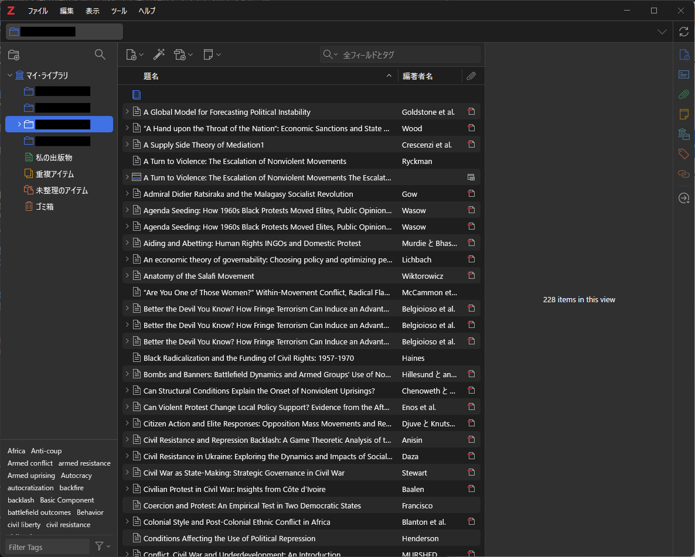
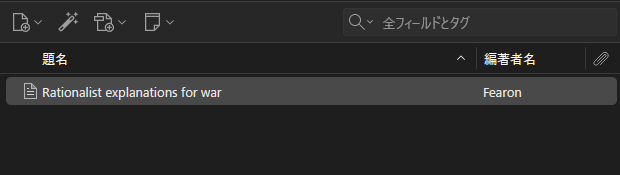
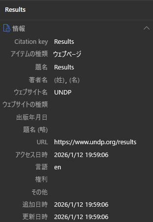
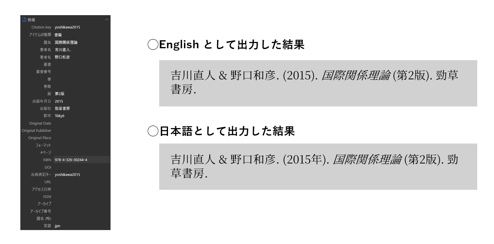

論文やレポートの執筆に際して必ず発生する面倒な作業の一つに、参考文献の管理があります。
「APAスタイルでどう書くんだっけ」とか「あの文献どこにあったっけ」とか。
特に、卒業論文の執筆で最初に戸惑う方も多いと思います。

だからこそ、声を大にして言いたい。
文献管理ソフトを使おう！！

このエントリーでは、Zotero という文献管理ソフトを例にとって、文献管理ソフトを使うメリット (というかなぜ必須なのか) を紹介しようと思います。

## 文献管理ソフトとは？
その名前のとおり、文献を管理するソフトです。
文献の情報 (書誌情報など) を保存しておいたり、論文 PDF を添付したりすることができます。
特に重要な機能が、前者の書誌情報の保存です。
これがあるからこそ、参考文献リストが容易に作れます。

### 代表的な文献管理ソフト
文献管理ソフトといえば、以下のいくつかが有名です。

- [Zotero](https://www.zotero.org/)
- [EndNote](https://support.clarivate.com/Endnote/s/?language=ja)
- [Mendeley](https://www.mendeley.com/)

いずれも基本無料で、有料版にアップグレードすることで多くの機能を使うことができます (オンラインのストレージ容量を増やすとか)。
また、EndNote については、一橋大学の学生であれば大学アカウントから利用できます。
文献を検索するときに欠かせない Web of Science と同じ企業が提供していることもあり、スムーズに接続できると聞いたことがあります。

このエントリーでは、このうち Zotero に絞って、使い方を説明します。
理由は単純で、筆者が使っているからです[^kaz]。
ただし、主な機能は他のソフトでも同じようにできるはずです。

[^kaz]: ちなみに私の指導教員も Zotero 派です。「それなら Zotero を使ってみようかな」と思う方もいるかも知れません。

### 文献管理ソフトでできること
文献管理ソフトでできる (ことで嬉しい) ことは、次のいくつかです。

1. 文献の書誌情報を保存することができる。
2. 文献のPDFを紐づけて保存することができる。
3. 文献の書誌情報を自動で取り込むことができる (プラグインが必要な場合あり)。
4. MS Word や Google Documents で、自動的に参考文献リストを作ることができる。
5. 一括で Bibtex できる (LaTeX ユーザー向け)。

このうち、研究室の後輩に Zotero を勧める最大の理由は、4番です (人によっては5番)。
卒業論文や修士論文などの長い文章を書くとき (もちろん研究計画もそうですが)、手書きで参考文献リストを作るのには無理があります。
面倒な引用スタイルを間違えてしまうのは必至として、引用していない文献をリストに載せたり、その逆をしたり (剽窃です) してしまう可能性があります。
そのような問題を緩和し、簡単に参考文献リストを作る (また、適切に文中引用する) ために、文献管理ソフトの使用を強く勧めます。

## Zotero を使ってみよう
ここからは実際に Zotero を使ってみます。

### Zotero とプラグインのインストール
Zotero は[公式ページ](https://www.zotero.org/)からダウンロード、インストールできます。
Windows, MacOS, Linux のいずれも対応しています。

また、Zotero Connector もインストールしておきます。
これは、Forefox や Chrome などのブラウザで文献サイトを開くと、そこから書誌情報を自動的に入手してくれる機能です (ただし精度はそこまで良くない)。

- [Chrome の拡張機能](https://chromewebstore.google.com/detail/zotero-connector/ekhagklcjbdpajgpjgmbionohlpdbjgc?hl=ja&pli=1)
- [Firefox の拡張機能](https://www.zotero.org/download/)

さらに、$\LaTeX$ を使う人は、[Better BibTeX for Zotero](https://retorque.re/zotero-better-bibtex/) というプラグインを入れると幸せになれます。

### Zotero を起動して試しに使ってみる
Zotero がインストールできたら、ひとまず起動してみます。
バージョンや OS などによって多少違いはあると思いますが、概ね次図のようになります。

試しに、新しいライブラリを作ってみます。
基本的には、レポートや論文など一つのプロジェクトに1つのライブラリを作っています。
そうする必要はないのですが、なんとなく。
左上のアイコンをクリックして、適当なライブラリを作ります。
そうすると、「マイライブラリ / MyLibrary」の下に新しいフォルダができます。

ここから、実際に文献を入れてみます。
まず、[こちらのサイト](https://www.cambridge.org/core/journals/international-organization/article/abs/rationalist-explanations-for-war/E3B716A4034C11ECF8CE8732BC2F80DD)にアクセスしてください。
Fearon (1995) の書誌情報が載っています。
このうち、DOI をコピーします。
https:// から全部コピーしてもいいですし、10. からでも構いません。

Zotero を開き、ライブラリの上部にある4つのアイコンのうち、左から2番目をクリックします。

DOI や ISNB を入力するフィールドが表れますので、入力して検索します。
しばらくすると、書誌情報が正しく登録されます。
このように、2番目のアイコンは、ISBN (書籍の番号) や DOI (インターネット上の識別子)、arXiv の ID などを使って文献を登録することができます。
次に説明するとおり、Zotero は Connector を使って文献を入れることもでき、便利です。
ただ個人的には、書籍や論文については上記の方法で入れたほうが確実なように感じます (URLとか)[^con]。

[^con]: 詳しくは知りませんが、Zotero Connector はサイト内の ISBN や DOI を探しているのだと思います。そのため、JSTOR のように、DOI を記載せず独自 URL が掲載されている場合、そちらに引っ張られてしまう印象があります。そういうのが嫌なので、私は識別子から入れています。

## 文献の登録方法
### 識別子を使う
すでに述べたとおり、ISBN (書籍の番号) や DOI (インターネット上の識別子)、arXiv の ID などを使って文献を登録することができます。

まず、Fearon (1995) の書誌情報が掲載されている[こちらのサイト](https://www.cambridge.org/core/journals/international-organization/article/abs/rationalist-explanations-for-war/E3B716A4034C11ECF8CE8732BC2F80DD)にアクセスしてください。
このうち、DOI をコピーします。
https:// から全部コピーしてもいいですし、10. からでも構いません。

Zotero を開き、ライブラリの上部にある4つのアイコンのうち、左から2番目をクリックします。
DOI や ISNB を入力するフィールドが表れますので、入力して検索します。
しばらくすると、書誌情報が正しく登録されます。

### Zotero Connector を使う
あなたが Firefox や Chrome などの標準的なブラウザを使っているなら、Zotero Connector という拡張機能を使うのが便利です。
これは、論文を掲載しているサイトから論文の情報 (可能なら PDF も) を自動的に取得してくれる機能です。

試しに、Powell (2006) の書誌情報が載っている[このサイト](https://www.cambridge.org/core/journals/international-organization/article/abs/war-as-a-commitment-problem/65DFFF1CD73A16F7ED4EEF6D4F934608) にアクセスしてみます。
サイトを開いた状態 (そして Zotero も開いている状態) で、拡張機能を使ってみます。
Firefox なら、右上の拡張機能ボタンから Zotero Connector を選んで押します (その他は知りません、すみません)。
すると、やはり書誌情報を手に入れることができました。

また、大学の図書館等を経由し、論文 PDF を取得可能な画面で同じことをすると、PDF ごと手に入れることができます。
これにより、後から PDF を添付する必要もなくなります。
便利！

また、多くのウェブサイトも Zotero Connector を通して情報を取得することができます。
たとえば、UNDPの活動の成果が報告されている[こちらのサイト](https://www.undp.org/results) にアクセスした状態で Connector を使うと、以下の図のように情報を取得できます。

ただ、この情報はやや不正確です。
APA スタイルでは、公的な組織のウェブサイトを引用する際、著者の欄に具体的な Agency、わからなければ Organization の名前を書くこととされています ([APA style](https://apastyle.apa.org/style-grammar-guidelines/references/examples/report-government-agency-references))。

正直、このような現象を回避する方法はわかりません。
特にウェブサイトや報告書などの場合は、手作業で情報を入れ直すのが最も効率が良いと思われます。
もちろん、あとに説明する方法 (スタイルの編集) である程度カバーできる部分があります。
そのため、自分にあった方法を使うのが結局は便利です。

Results. (n.d.). UNDP. Retrieved January 12, 2026, from https://www.undp.org/results

## 日本語文献を引用する
APA Style で日本語文献を引用すると、うまくいきません。
たとえば吉川・野口『国際関係理論 (第2版)』をそのまま引用すると、画像のようになります。

特に後者は、出版年に「年」が入っていてちょっと気持ちが悪いです。
また、書籍名が斜体になっていることと、名前の後にピリオドが入っているのも個人的にはあまり好きではありません。

この問題に対処する方法の一つとして、スタイルの編集を推奨します。