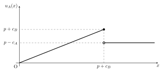

## 基本のモデル｜戦争の交渉モデル
国際関係論という学問は、常に「なぜ戦争は発生するのか」と問い続けてきた。
この問いはもちろん、戦争が人類にとって避けるべきものであるという認識からも重要である。
しかし、学術的に重要なパズルもある。
それは、戦争がコスト高であるにもかかわらず発生している点である。
同じ結果が得られるのなら、戦争よりも交渉で解決したほうが、お互いにとっておトクである。
なぜなら、戦争が起これば自国民も相手国民も死に、兵器のために資金が必要となり、土地は焼け、経済活動は滞るからである。

このパズルに答えるための一つの枠組みが、交渉理論（Bargaining Theory）である。
本稿では、国際関係論において交渉理論が組み立てられた過程をまとめたい。
なお、以下の説明ではできるだけゲーム理論の言葉を使う。
例えば、「おトク」とは言わず「より利得が高い」などと書く。

## 戦争はコスト高である
戦争の交渉モデルを扱った最初の文献の一つとして、Fearon (1995) がある。
まず、Fearon の交渉モデルを追いながら、戦争がコスト高である（＝より利得が高い「交渉」の道が存在する）ことを確認する。

2つの国家 $A$, $B$ が、争点 $X = [0, 1]$ の配分を巡って争っている。
$x \in X$ は $A$ の取り分で、$B$ は $1 - x$ を受け取ることになる[^pi]。
国家間が戦争をすると、$p$ の確率で $A$ が勝利し、争点のすべて、すなわち 1 を獲得する。
また、戦争によって、$A$ と $B$ はそれぞれ $c_A, c_B$ （いずれも正）のコストを支払う。
したがって、戦争が発生した際の $A$ と $B$ の期待利得は、それぞれ $p - c_A, 1 - p - c_B$ である。

なお、モデルに3つの仮定を設ける。
すなわち、(1) 完備情報であること、(2) プレイヤーはリスク中立的であるか、リスク回避的であること、及び、(3) 交渉の結果 $x$ は連続な値を取ることができることの3つである。

[^pi]: パイを切り分けることを考えるとよい。パイ全体を1として、それを $A$ と $B$ でどのように分配するかが重要である。もちろん、$X$ がパイであり、$x$ はその配分方法（$A$ が受け取るパイの大きさ）である。

いま、$A$ と $B$ がいずれもリスク中立的であるとすると、両者にとって戦争よりも交渉が望ましいような配分方法は必ず存在する。
$A$ にとって交渉が望ましい条件は $u_A(x) = x > p - c_A$ であり、$B$ の条件は　$u_B(x) = 1 - x > 1 - p - c_B$ である。
これらの条件をまとめると、$p - c_A < x < p + c_B$ となり、$c_A > 0, c_B > 0$、つまり戦争にはコストがかかるため、これを満たす $x$ は存在する。
また、この交渉可能な領域 $(p - c_A, p + c_B)$ を、バーゲニング・レンジ (Bargaining range) という。

{width=75%}

::: {.callout-tip collapse="true"}
## リスク選好によって結論は変わるか？
この説明では、リスク中立であることを仮定したが、リスク回避的 / リスク愛好的なプレイヤーだと、どうであろうか。
証明は省略するが、リスク回避的な場合は同様の結論を得、リスク愛好的な場合は、必ずしもバーゲニング・レンジが存在するとは限らない。
:::

## Fearon の3つの合理的な戦争の原因
「戦争にコストがかかるならば、戦争よりも利得の高い交渉の結果が必ず存在する」という命題が得られたにもかかわらず、実際に戦争は起こっている。
Fearon は、戦争が発生する3つの主要な原因を説明している。

### 情報の非対称性：私的情報と偽るインセンティブ
命題は、完備情報のもとでの結論である。
すなわち、$A$ も $B$ も、$A$ の勝率 $p$ と、自分と相手のコスト $c_i$ を正しく知っているという前提がある。
戦争の勝率を正しく知るためには、少なくとも相手国の軍事力（部隊や兵器の配置、兵士の熟練度など）を知り尽くしている必要があるが、そのようなことは現実にはありえない。
また、戦争の勝率だけでなく、相手の戦争への意思（willingness to fight）も正しく捉えられるとは限らない。
戦争の意思は、例えば争点の価値をどのように見積もっているかに影響される。
モデルにおけるコスト $c_i$ は、絶対的なコスト（支出）ではなく、争点の価値に対する支出の比[^value]であり、相手がその争点をどれほど重視しているかによって異なる。
そのような認識は相手に正しく伝わらず、コストの計算を狂わせる。

[^value]: これは、争点を $[0, 1]$ に正規化したことに関係している。国家 $i$ にとっての争点全体の価値を $V_i$ とし、戦争の純粋なコストを $k_i$ とすると、確率 $p$ で勝利する戦争の期待利得は $pV_i - k_i$　である。ここで、争点を $[0, 1]$ に正規化するために、利得を $V_i$ で割ると、$p - \frac{k_i}{V_i}$ となる。つまり、これまで考えていた $c_i$ とは $\frac{k_i}{V_i}$ のことで、価値に対する支出の比であると言える。

さらに、国家は、交渉の結果をより自国にとって有利にしたい。
そのために、あえて自国の軍事力を高く偽って、バーゲニング・レンジを自国に有利な方向へ誤認識させるインセンティブがある。

### コミットメント問題
完備情報の下であっても、やはり交渉に至らない可能性がある。
その一つをコミットメント問題といい、将来にわたって交渉の結果を遵守し続けることを信頼できない場合をいう。

コミットメント問題が発生する第一の理由は、先制戦争の優位である。
これまで見てきた戦争の勝率 $p$ は、双方が合意に至らずに戦争をした場合の勝率を表していた。
しかし、先んじて奇襲攻撃などにより攻撃を行うことが、攻撃側 v.s. 防御側の構図を作り出し、先制攻撃側に優位な状況を作り出すことが考えられる。
攻撃側に立った国の勝率が大きくなるならば、バーゲニング・レンジはその国にとって有利である。
または、自国のコストが小さくなるならば、やはりバーゲニング・レンジの端が有利な方へと移動する。
これにより、バーゲニング・レンジが消滅してしまうと、もはや交渉の結果は起こり得ない。

第二の理由は、予防戦争である。
予防戦争とは、将来のパワーバランス（つまり $p$）の変化が起こって自国に不利なバーゲニング・レンジになる前に戦争を行うことである。
例えば、相対的に弱くなる $A$ と相対的に強くなる $B$ を考える（両国とも、この変化が起こることは知っている）。
パワーバランスが変化する前と後のバーゲニング・レンジが、図のようになっているとする。

{width=75%} 

この場合、変化前の交渉の結果は、2回目にはバーゲニング・レンジ内にはなく（2つのレンジが重なっておらず）、$B$ は交渉の結果を守らずに戦争を起こす方がよい。
したがって、1度目の交渉の結果を、$B$ が遵守する信憑性はない。
$A$ からすれば、交渉を破られて戦争を起こされるくらいならば、勝率が高い現在に戦う方が望ましい。
このような、将来のパワーバランスを見越した戦争を、予防戦争という。

### 争点の不可分性
国家間で争点となるもの、例えば特定の領土などは、それ自体が両国家によって死活的に重要であることがある。
それは、例えば、その領土が国家のパワーに直結する場合である。
そのような場合、その領土を分割することは、パワーバランスそのものを変更させ、コミットメント問題を生じさせる可能性がある。
また、宗教的・民族的に重要な地域を分割することに強い反対がある場合なども考えられる。
これらの不可分性は、交渉領域内で可能な分割があるという仮定に反する。

## 基本のモデル｜最後通牒のバーゲニング
これまで、Fearon (1995) の最もわかりやすいゲームを見てきた。
ここからは、Spaniel (2024) にならって、最後通牒ゲームを用いてモデル化を行い、均衡を求めることで、実際の交渉の結果がどのようになるかを分析する。

まず、Fearon と同様に、2つの国家 $A$, $B$ が、争点 $X = [0, 1]$ の配分を巡って争っている。
$A$ には提案権があり、最初の行動で配分 $x$ を提案する。
$A$ が提案を行うと、$B$ はそれを受け入れるか拒否するかを決定する。
受け入れるならば、提案通りの利得を得、拒否するなら直ちに戦争が開始する。
国家間が戦争をすると、$p$ の確率で $A$ が勝利し、争点のすべて、すなわち 1 を獲得する。
また、戦争によって、$A$ と $B$ はそれぞれ $c_A, c_B$ （いずれも正）のコストを支払う。
したがって、戦争が発生した際の $A$ と $B$ の期待利得は、それぞれ $p - c_A, 1 - p - c_B$ である。

もっとも単純なモデルは、次のツリーで表される。

{width=75%} 

### 均衡を求める
展開形ゲームは、部分ゲーム完全均衡を求めることで解くことができる。

このゲームの最後の手番で、$B$ は受け入れが拒否かを選択する。
受け入れる条件は、$1 - x \ge 1 - p - c_B$、 つまり $x \le p + c_B$ である。
その前の手番で、$A$ は提案 $x$ を決めるのだが、利得関数は以下の図のようになる。

{width=75%}

$p + c_B$ までは、要求を増やすごとに利得が増えるが、$p + c_B$ を超えると拒否されるので、戦争の期待利得しか得られない。
したがって $A$ は、$x = p+c_B$ を要求することが最適応答である。よって均衡は、$A$ が $x=p+c_B$ を要求し、$B$ が受け入れることである。

## 先制攻撃の優位
先制攻撃の優位は、Fearon のいうコミットメント問題の一つである。
先制攻撃を行うことで、自国の勝率が上がったりコストが下がることにより、交渉の余地がなくなることであった。
これを、最後通牒のモデルで考えてみる[^s3]

[^s3]: Spaniel (2024) の 3.1 節に基づく。

まず両者は、交渉を行うか先制攻撃をするかを決める。
これは、相手の決定がわからない同時手番ゲームによって決める。
もし両者が先制攻撃をするなら（もはや「先制ではないが」）、通常の戦争が始まる。
片方だけが先制攻撃をするなら、その国家の勝率が $\delta_i$ だけ上がった状態で戦争が始まる。
両者とも交渉を選ぶなら、先に見たような最後通牒のバーゲニングが行われる。

[WIP]

## 予防戦争
予防戦争も、Fearon の挙げたコミットメント問題の一つに数えられる。
予防戦争が発生する重要な要因は、パワーバランスの変化であった。
ここでは、2回の交渉において、$A$ の勝率が $p$ から $p'$ へと変化すると考えることで、これをモデル化する[^s4]。

[^s4]: Spaniel (2024) の 4.1 節に基づく。
marp サーバーが起動直後に終了しました（code 3）。 詳細: [ ERROR ] Listen port 8080 is already used in the other process. Try again after / closing the relevant process, or specify another port number through / PORT env.
ゲームは $A$ の行動から始まる。
$A$ は、将来（ゲームにおいては次期）に $B$ が相対的に強くなることを知っている。
そのため、ここで一回目の要求 $x_1 \in [0, 1]$ という選択肢の他に、$B$ に対し予防戦争を起こすことも可能とする。
予防戦争が起これば、現在の勝率である $p$ で $A$ が勝利し、その期待利得は $p_A - c_A$ となる。
要求をするならば、$B$ は受け入れるか拒否するかを決める。
$B$ が拒否すれば、やはり戦争が発生する。
$B$ が受け入れた場合、ゲームは次の期に移る。
2期目では、$A$ は衰退しており、戦争の勝率は $p' < p$ に下がっている。
再び、$A$ は要求 $x_2 \in [0, 1]$ を提示し、$B$ は受け入れるか拒否するかを決める。

{width=100%} 

ここで、各結果に対するプレイヤーの利得は、これまでと少し違う方法で計算する。
国家間の交渉は、無限に繰り返される。
これは、実際に無限の年数ないし回数の交渉を行うことが保証されているというより、いつ終了するかわからない期間で交渉を続けるという意味である。
利得は、一度確定すればずっと受け取ることができる。
これを、割引因子と無限級数の和の考え方によって定式化する。
現在の期に $V$ という価値がある利得は、次の時には割引因子 $\delta \in [0, 1]$ をかけた $\delta V$ まで価値が下がってしまう。
簡単に言えば、同じ財なら早くにもらったほうが価値が高い（逆に、時間が経つごとに価値が下がっていく）ことを指している。
ここで重要な公式として、$1 + \delta + \delta^2 + \cdots = \frac{1}{1 - \delta}$ を覚えておくと、計算がしやすい。

::: {.callout-tip collapse="true"}
## なんで急に無限を考える？
1回きりの交渉だとしても、交渉結果をずっと受け取れるのだから、同じ論理で無限級数の和を考えるべきではないか？　と思った。
結論としては、その考えは正しい。
つまり、これまで見てきた別のモデルでも、割引因子をかけた次期の利得、その次の利得…を足して良い。
ただし、1期であればすべての利得に同じ $\frac{1}{1 - \delta}$ をかけるだけで、大小関係は変わらない。
したがって、1期だけのモデルではすべての利得に $1 - \delta$ をかけて計算を簡単にしているだけ、と考えるほうが自然だと考えた。
:::

### 均衡を求める
これまでと同様に、均衡を求める。
$A$ の二回目の要求 $x_2$ に対する $A$ の利得は、$B$ に受け入れられるとき $x_1 + \frac{\delta x_2}{1 - \delta}$ で、拒否されるとき $x_1 + \frac{\delta(p'-c_A)}{1 - \delta}$ である。
$B$ が要求を受け入れる条件は、$1 - x_1 + \frac{\delta(1 - x_2)}{1 - \delta} \ge 1 - x_1 + \frac{\delta(1 - p' - c_B)}{1 - \delta}$、すなわち、$x_2 \le p' + c_B$ である。
受け入れられるときの $A$ の利得は $x_2$ に対して単調に増加し、$x_2 = p' + c_B$ を要求したときの利得は、拒否されたときの利得より大きいので、$A$ は $x_2 = p' + c_B$ を要求する。

$A$ の最初の要求も同様に、$B$ に受け入れられれば $x_1 + \frac{\delta(p' + c_B)}{1 - \delta}$ で、拒否されると $\frac{p - c_A}{1 - \delta}$ である。
$B$ が要求を受け入れる条件は、$1 - x_1 + \frac{\delta(1 - p' - c_B)}{1 - \delta} \ge \frac{1 - p - c_B}{1 - \delta}$、すなわち、$x_1 \le \frac{p - \delta p'}{1 - \delta} + c_B$　である。
受け入れられる範囲では、$A$ は最大の $x_1 = \frac{p - \delta p'}{1 - \delta} + c_B$ を要求して $\frac{p - \delta p'}{1 - \delta} + c_B + \frac{\delta(p' + c_B)}{1 - \delta} = \frac{p + c_B}{1 - \delta}$ を受け取る。
または、受け入れられないほど大きな要求をして $\frac{p - c_A}{1 - \delta}$ を受け取ることもできる。

ここで、$A$ は最大の要求をすることができるであろうか。
要求の範囲は $[0, 1]$ であったが、最大の要求 $x_1 = \frac{p - \delta p'}{1 - \delta} + c_B$ は、この範囲に入っている保証がない。
入っていれば最大の要求をするし、入っていなければ範囲内の最大である $1$ を要求することで我慢するしかない。

さきに、最大の要求が $[0, 1]$ に含まれている場合を考える。
すなわち、$\frac{p - \delta p'}{1 - \delta} + c_B \le 1$ のとき、$A$ は $x_1 = \frac{p - \delta p'}{1 - \delta} + c_B$ を要求し、 $B$ は受け入れる。
そして、$A$ が予防戦争を仕掛けるか要求を行うかは、それぞれの利得を比較することでわかる。
いま、$\frac{p - c_A}{1- \delta} < \frac{p + c_B}{1 - \delta}$ であるので、要求を行うほうが利得が高い。
したがって、この均衡では、$A$ は $x_1 = \frac{p - \delta p'}{1 - \delta} + c_B$ 及び $x_2 = p' + c_B$ を要求し、$B$ はすべて受け入れる。
すなわち、予防戦争は発生しない。

つぎに、$A$ の最大の要求が $[0, 1]$ に含まれていない場合を考える。
すなわち、$\frac{p - \delta p'}{1 - \delta} + c_B > 1$ のときである。
これを、見やすさのために $\delta$ について整理すると、$\delta > \frac{1-p-c_B}{1-p'-c_B}$ と書き直すことができる。
この要件は、$\delta$ について解釈するなら、国家が十分辛抱強い（割引因子が1に近い＝割引されない）と考えることができる。
または右辺に注目すれば、分母と分子の違いは勝率 $p, p'$ である。
つまり、変化前と変化後の $B$ の戦争の利得の比である。
これが十分小さいことは、変化が大きく、$B$ が急速に成長していることを表す。

このとき、$A$ は $x_1 = 1$ を提案して必ず受け入れられる。
それによって得られる期待利得は $1 + \frac{\delta(p' + c_B)}{1 - \delta}$ であり、予防戦争の期待利得 $\frac{p - c_A}{1- \delta}$ と比較すると、大小関係は明らかでない。
$\frac{p - c_A}{1- \delta} > 1 + \frac{\delta(p' + c_B)}{1 - \delta}$、すなわち、$\delta > \frac{1 - p + c_A}{1 - p' - c_B}$　のとき、$A$ は予防戦争を起こす。
一方で、$\frac{p - c_A}{1- \delta} \le 1 + \frac{\delta(p' + c_B)}{1 - \delta}$ のとき、$A$ は $1$ を提案して受け入れられる。

ところで、明らかに $\frac{1 - p + c_A}{1 - p' - c_B} > \frac{1 - p - c_B}{1 - p' - c_B}$ であるので、2つ目の条件が満たされているときは、当然1つ目の条件も満たされている。
したがって、予防戦争が起こる条件は $\delta > \frac{1 - p + c_A}{1 - p' - c_B}$ である。