## はじめに
### 前回のおさらい
本記事は、「Zotero を使おう」シリーズの2回目です。
前回の記事はこちら。

 
::: {.article-card}
[](./zotero-collect.qmd)

[**Zotero を使おう：文献を集める**](/posts/zotero-cite.qmd)

文献管理ソフト「Zotero」の、一番さいしょの使い方を説明します。
:::

前回の記事では、Zotero をインストールし、文献を収集する方法までを説明しました。

### 今回やること
今回の記事は、収集した文献を実際に文章中に引用し、文献リストを作成するところまで扱います。
Word・Google Docs・Typst・$\LaTeX$ の4つのツールで、引用を行う方法を説明しています。
使用するツールのセクションだけお読みいただければ、わかるようになっています。

なお、すべての操作は、Zotero アプリを開いた状態で行ってください。


## 引用スタイルを選ぶ
大学・大学院でレポートや論文を執筆したことがある方は、文献を適切に引用する重要性を理解していると思います。
特に、学術的な文章を書く際は、一定のルールに従って文献を表示することが基本的なスキルとして求められます。
これを引用スタイルといいます。
このブログでは、著者の個人的な好みから APA スタイルを主に扱っています。

::: {.article-card}
:::

これからレポートや論文を書くにあたり、文献の引用スタイルを先に決めてください。
スタイルは好みによるところがありますが、**投稿論文であれば投稿規定に従うことが必須**です。
政治学でよく用いられるのは、APA、MLA、シカゴでしょうか。
ジャーナルによっては、独自の規定を設けている場合も多いです。

とはいえ、引用スタイルはあとから変更することも原理上は可能です。
私たちは、Zotero によって文献リストを手書きすることから解放されるわけですから、そこまで問題にならないかもしれません。
ただ、個人的には最初にスタイルを決めておくほうが精神衛生上よいと思います。

この記事では、APA 7th での引用を専ら扱います。
また、次の記事では日本語文献の引用方法を説明しますが、APA (風) の日本語スタイルを配布しています。
こちらは、APA のみ扱えて、他のスタイルには現時点では変換できないので、ご注意ください。

以降、いくつかの執筆ツールで引用する方法をまとめます。
それぞれ、使うツールの部分だけご覧になればよいと思います。

## Word で引用する
政治学の分野で論文を書く人のうち、ほとんどの人は MS Word を使用していると思います。
Word は、Zotero と連携することで、簡単に文献を引用し、また引用した文献から参考文献リストを作成することが可能です。

### Word と Zotero の連携

通常、Zotero には Word 用のプラグインが含まれており、インストールすれば勝手に連携されます。Word で新規文書を開き、上部に「Zotero」という表示があれば、連携終了です。

表示がない場合、Zotero の編集 (Edit) から 設定 (Settings) を開き、引用 (Citation) をクリックします。ページ最下部に Microsoft Word という部分があり、「アドイン Microsoft Word は現在インストールされています/されていません。」の表示があるはずです。インストールされていない場合、その下のボタンからインストールし、Zotero と MS Word を再起動すれば、連携されます。

### 文中で引用する
実際に文章を書きながら、文献を引用してみます。

Word の画面上部から「Zotero」タブを開き、Add/Edit Citation というボタンを押します。スタイルを選択できるので、 APA Style 7th edition を選択します。言語は英語とすることに注意。「出典表記を自動的に更新する」にはチェックを入れておきます。そのうえで、「OK」をクリックします。

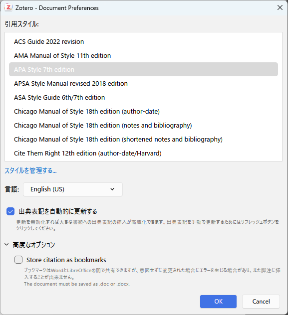

すると、文献を探すウィンドウが開きます。ここでは試しに、Fearon (1995) を引用してみます。著者名やタイトルの一部を記入すると、候補に出てきます。そのままエンターを押すか、文献をクリックすると、下の画像のように、文献が選択された状態になります。

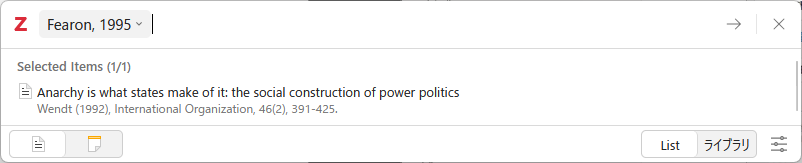

更にエンターを押すと、文書の中に (Fearon, 1995) という文字列が自動的に追加されました。これが、基本的な引用の方法です。

### 括弧内引用する

Add/Edit Citation は、デフォルトで括弧内引用の形で文献を挿入します。

文献によっては、括弧内にページ数などを追加したい場合があると思います。その場合は、Add/Edit Citation で文献を選択したあと、文献の横にある、下向きの三角形のマークを押します。すると、次のようなフィールドが出現し、ページなどを追加することができます。

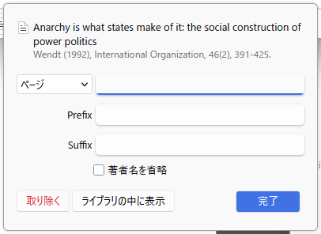

また、Prefix は括弧の冒頭、Suffix は括弧の終わりに文字列を手動で追加するものです。例えば、「訳は著者による」などがあるでしょうか。

複数の文献を引用する際は、Add/Edit Citation で複数の文献を選択した状態でエンターを押します。選択した順番に限らず、第一著者の名前のアルファベット順に並びます （右下の「Keep sources sorted」にチェックが付いていることが必要）。

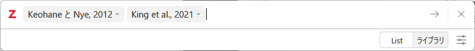

なお、引用部分は手書きで修正することはできません [^hand]。修正したい場合は、引用の括弧を選択した状態 (括弧全体がハイライトされている状態) で、Add/Edit Citation をクリックします。

[^hand]: 厳密には、手書きで内容を書き換えることはできるのですが、情報が更新されるために上書きされて元の内容に戻ってしまいます。

### テキスト内引用する

「Fearon (1995) は～」のように、テキスト内で著者年を示して文献を引用する際、すこし方法が異なります。

括弧内引用と同様、Add/Edit Citation を開き、文献を選択して文献の横にある、下向きの三角形のマークを押します。すると、「著者名を省略」というチェックボックスがあります。これにチェックを入れると、例えば Fearon (1995) なら「(1995)」だけが挿入されます。そのため、括弧の直前に、自ら著者の名前をタイプする必要があります。

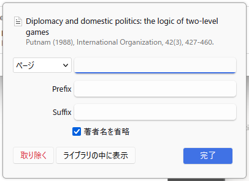

### 文献リストを作る

さて、上記の方法でいくつかの文献を引用したら、最後に文献リストを追加します。

文末にカーソルを移動して、画面上部の Zotero タブ内の「Add/Edit Bibliography」をクリックします。すると、適当な見た目の文献リストが追加されます。このあと、リスト全体を選択した状態でWord の段落設定からぶら下げインデントと行間を設定します。
この点は、執筆者の納得の行く見た目になるまで試行錯誤するのがよいと思います。

この方法でリストを作成すると、引用した文献が過不足なくリストに追加されます。嬉しい。ただし、手書きで追加した文献はリストに含まれませんので、注意してください。

最終的に、例えば以下のようなドキュメントが完成します。

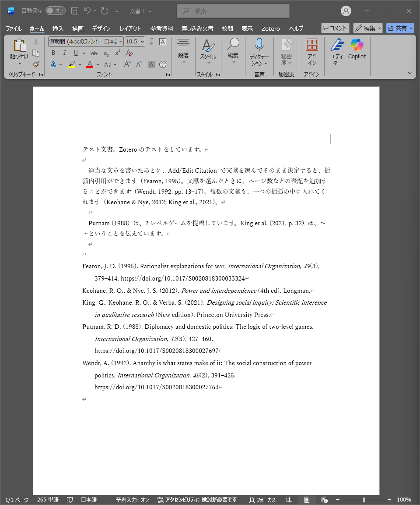

なお、文献を追加したり削除したりした場合、Zotero タブの「Refresh」を押すことで文献リストを更新することができます。嬉しい。


## Google Docs で引用する
Word に次いで、最近使用する方が多いと思うのが、Google Docs です。
私もたまに使います。

### Google Docs と Zotero の連携
Google Docs は基本的にブラウザ上で操作しますが、そのブラウザに Zotero Connector がインストールされていることが前提になります。
Zotero Connector のインストール方法は前回の記事をご覧ください。
最も簡単なのは、Zotero の「ツール (Tools)」から、Browser Connector をインストールするという項目を選択することです。

Zotero Connector がインストールされたブラウザで Google Docs を開くと、上部に Zotero というタブが追加されているはずです。

### 文中で引用する
実際に文章を書きながら、文献を引用してみます。

Docs の画面上部から「Zotero」タブをクリックし、Add/Edit Citation を選択します。
初回時ログインを求められるので、Google Docs を開いている Google アカウントでログインしてください。

スタイルを選択できるので、 APA Style 7th edition を選択します。言語は英語とすることに注意。
「出典表記を自動的に更新する」にはチェックを入れておきます。
そのうえで、「OK」をクリックします。

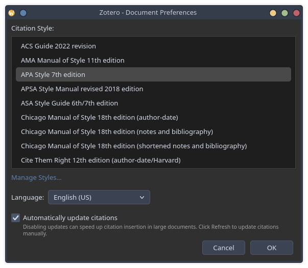

すると、文献を探すウィンドウが開きます。ここでは試しに、Fearon (1995) を引用してみます。著者名やタイトルの一部を記入すると、候補に出てきます。そのままエンターを押すか、文献をクリックすると、下の画像のように、文献が選択された状態になります。

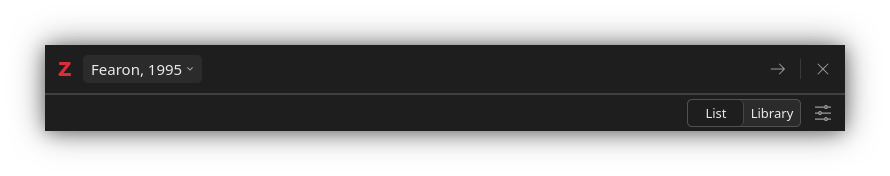

更にエンターを押すと、文書の中に (Fearon, 1995) という文字列が自動的に追加されました。これが、基本的な引用の方法です。

### 括弧内引用する
Add/Edit Citation は、デフォルトで括弧内引用の形で文献を挿入します。

文献によっては、括弧内にページ数などを追加したい場合があると思います。その場合は、Add/Edit Citation で文献を選択したあと、文献の横にある、下向きの三角形のマークを押します。すると、次のようなフィールドが出現し、ページなどを追加することができます。

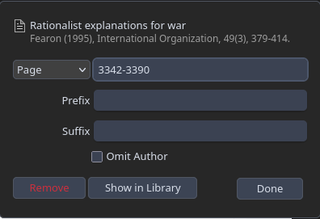

また、Prefix は括弧の冒頭、Suffix は括弧の終わりに文字列を手動で追加するものです。例えば、「訳は著者による」などがあるでしょうか。

複数の文献を引用する際は、Add/Edit Citation で複数の文献を選択した状態でエンターを押します。選択した順番に限らず、第一著者の名前のアルファベット順に並びます （右下の「Keep sources sorted」にチェックが付いていることが必要）。

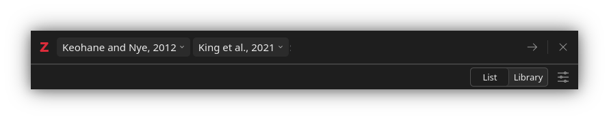

なお、引用部分は手書きで修正することはできません [^hand2]。
修正したい場合は、引用の括弧を選択した際に出る編集のボタンを押します。

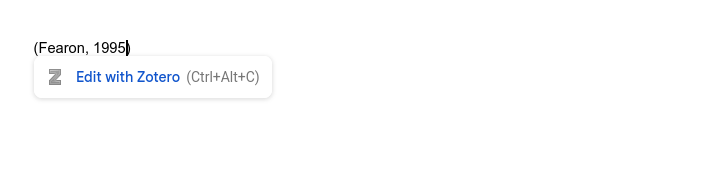


[^hand2]: 厳密には、手書きで内容を書き換えることはできるのですが、情報が更新されるために上書きされて元の内容に戻ってしまいます。

### テキスト内引用する

「Fearon (1995) は～」のように、テキスト内で著者年を示して文献を引用する際、すこし方法が異なります。

括弧内引用と同様、Add/Edit Citation を開き、文献を選択して文献の横にある、下向きの三角形のマークを押します。すると、「著者名を省略」というチェックボックスがあります。これにチェックを入れると、例えば Fearon (1995) なら「(1995)」だけが挿入されます。そのため、括弧の直前に、自ら著者の名前をタイプする必要があります。

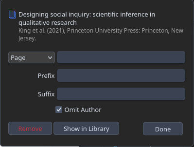

### 文献リストを作る

さて、上記の方法でいくつかの文献を引用したら、最後に文献リストを追加します。

文末にカーソルを移動して、画面上部の Zotero タブ内の「Add/Edit Bibliography」をクリックします。すると、適当な見た目の文献リストが追加されます。このあと、リスト全体を選択した状態で Docs の段落設定からぶら下げインデントと行間を設定します。
この点は、執筆者の納得の行く見た目になるまで試行錯誤するのがよいと思います。

この方法でリストを作成すると、引用した文献が過不足なくリストに追加されます。嬉しい。ただし、手書きで追加した文献はリストに含まれませんので、注意してください。


なお、文献を追加したり削除したりした場合、Zotero タブの「Refresh」を押すことで文献リストを更新することができます。嬉しい。

## Typst で引用する
まず、前回の記事で説明した通り、Better BibTeX をインストールします。
インストールできていれば、ツール > プラグインの画面で次のように表示されているはずです。

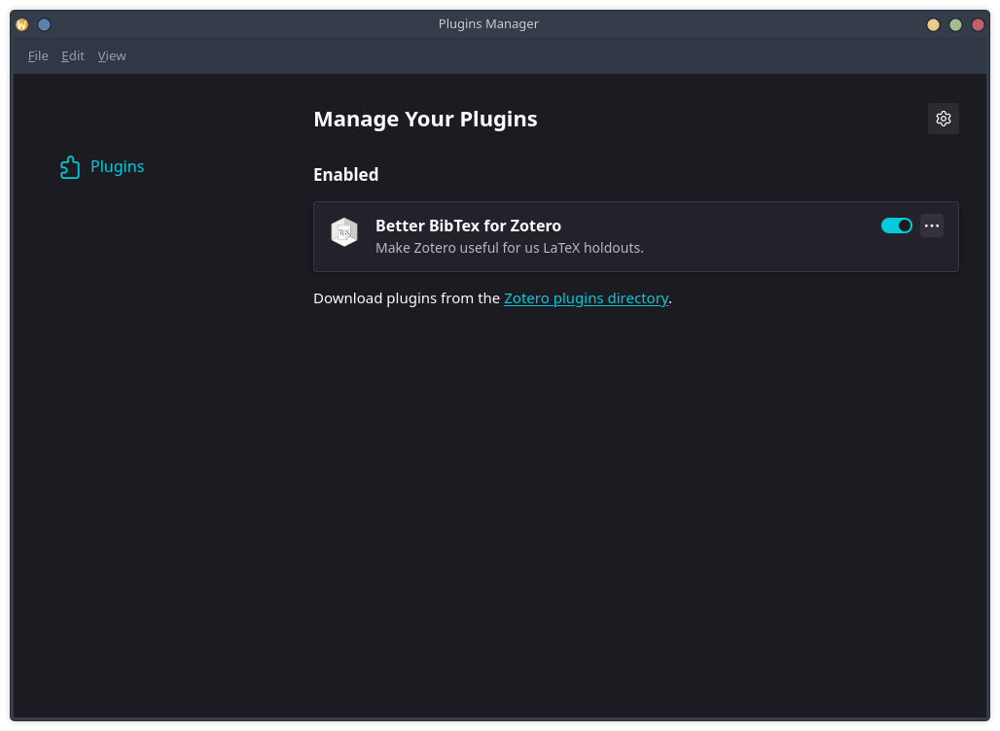

Better BibTeX が有効化された状態で、Zotero のコレクションを右クリックし、 「Export Collection...」を選択します。
形式を問われるので「Better BibTeX」を選択し、OKを押すと、.bib ファイルが任意の場所にダウンロードされます。
ちなみに、「Keep updated」にチェックをすると、コレクション内の情報に変更が加えられるたびに、更新された BibTeX ファイルを作成してエクスポートします。

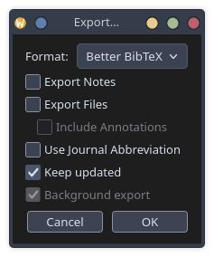

なお、.bib ファイルは、執筆しているフォルダに保存するのがよいです。
そうすることで、参照もしやすいですから。

.bib ファイルが用意できたら、Typst 文書の冒頭に次のように記述して読み込みます。

``` typst
#bibliography("references.bib", style: "apa")
```

文中で引用するときは、`@citekey` の形式で記述します。
citekey は、Zotero の各文献に表示されている引用キー (citation key) のことです。

```typst
国家間の戦争の原因については諸説ある @fearon1995。
```

参考文献リストは、`#bibliography()` を記述した箇所に、自動的に生成されます。
なお、Typst の引用機能の詳細については、下記を参照してください。

- Typst 公式ドキュメント「[Bibliography](https://typst.app/docs/reference/model/bibliography/)」

## $\LaTeX$ で引用する
$\LaTeX$ を使っている人は、ある程度機械操作やプログラミングに詳しいと思うので、簡潔に説明します。

まず、前回の記事で説明したとおり、Better BibTeX をインストールします。
ツール > プラグインの画面で次のように表示されているはずです。


Better BibTeX が有効化された状態で、Zotero のコレクションを右クリックし、 「Export Collection...」を選択します。
形式を問われるので「Better BibTeX」を選択し、OKを押すと、.bib ファイルが任意の場所にダウンロードされます。
ちなみに、「Keep updated」にチェックをすると、コレクション内の情報に変更が加えられるたびに、更新された BibTeX ファイルを作成してエクスポートします。


なお、.bib ファイルは、執筆しているフォルダに保存するのがよいです。
そうすることで、参照もしやすいですから。

あとは、$\LaTeX$ 文書内で、BibTeX ファイルを参照するだけです。
$\LaTeX$ 文書内で `.bib` を扱う方法は、下記のページを参照してください。

- TEX Wiki「[文献引用](https://texwiki.texjp.org/?%E6%96%87%E7%8C%AE%E5%BC%95%E7%94%A8)」
- TEX Wiki「[BibTeX 関連ツール](https://texwiki.texjp.org/?BibTeX%E9%96%A2%E9%80%A3%E3%83%84%E3%83%BC%E3%83%AB)」
- TEX Wiki「[BibLaTeX](https://texwiki.texjp.org/?Biblatex)」

