## はじめに
### 文献管理ソフトを使おう
論文やレポートの執筆に際して必ず発生する面倒な作業の一つに、参考文献の管理があります。
「あの文献、どこで見つけたんだっけ」とか「さっき読んでた論文、何年だっけ」といった、文献情報を管理するのは大変です。
また、「APAスタイルでどうやって引用するんだっけ」とか「アルファベット順にするの面倒！」という、引用の際の苦労も出てきます。
特に、卒論などで初めて学位論文を書く人は、最初に戸惑う方も多いと思います。

そんなあなたに、声を大にして言いたい。
文献管理ソフトを使おう！！

この記事では、Zotero という文献管理ソフトの使い方を説明します。
なぜ文献管理ソフトが必須なのかが伝われば幸いですし、Zotero マスターになって、文献管理の苦行から解放されてほしいと思います。

### 文献管理ソフトとは？
その名前のとおり、文献を管理するソフトです。
文献の情報 (書誌情報など) を保存しておいたり、論文 PDF を保存したりすることができます。

特に重要な機能が、前者の書誌情報の保存です。
これがあるからこそ、参考文献リストが容易に作れます。
逆に、手書きで参考文献リストを作るのは非常に大変ですし、書き忘れや間違いのせいで剽窃の危機に陥るなどもってのほかです。

### 代表的な文献管理ソフト
文献管理ソフトといえば、以下のいくつかが有名です。

- [Zotero](https://www.zotero.org/)
- [EndNote](https://support.clarivate.com/Endnote/s/?language=ja)
- [Mendeley](https://www.mendeley.com/)

いずれも基本無料で、有料版にアップグレードすることで多くの機能を使うことができます (オンラインのストレージ容量を増やすとか)。
また、EndNote については、大学によっては期間契約で利用できます。
文献を検索するときに欠かせない Web of Science と同じ企業が提供していることもあり、スムーズに接続できると聞いたことがあります。

この記事では、このうち Zotero に絞って、使い方を説明します。
理由は単純で、筆者が使っているからです[^kaz]。
ただし、主な機能は他のソフトでも同じようにできるはずです。

[^kaz]: ちなみに私の指導教員も Zotero 派です。

### 文献管理ソフトでできること
文献管理ソフトでできる (ことで嬉しい) ことには、例えば次のいくつかがあります。

1. 文献の書誌情報を保存することができる。
2. 文献のPDFを紐づけて保存することができる。
3. 文献の書誌情報を自動で取り込むことができる (プラグインが必要な場合あり)。
4. MS Word や Google Documents で、自動的に参考文献リストを作ることができる。
5. $\LaTeX$ 用の文献ファイルを書き出せる ($\LaTeX$ ユーザ向け)。

このうち、研究室の後輩に Zotero を勧める最大の理由は、4番です (人によっては5番)。
卒業論文や修士論文などの長い文章を書くとき (もちろん研究計画もそうですが)、手書きで参考文献リストを作るのには無理があります。
面倒な引用スタイルを間違えてしまうのは必至として、引用していない文献をリストに載せたり、その逆をしたり (剽窃です) してしまう可能性があります。
そのような問題を緩和し、簡単に参考文献リストを作る (また、適切に文中引用する) ために、文献管理ソフトの使用を強く勧めます。

## Zotero を使ってみよう
ここからは、実際に Zotero を使ってみます。

### Zotero と、プラグインのインストール
Zotero は[公式ページ](https://www.zotero.org/)からダウンロード、インストールできます。
Windows, MacOS, Linux のいずれも対応しています[^linux]。

[^linux]: Linux の場合、インストール方法が異なる場合があります。ディストリビューションにあった方法で、正しくインストールしてください。以後のすべての議論について同じです。

また、Zotero Connector もインストールしておきます。
これは、Forefox や Chrome などのブラウザで文献サイトを開くと、そこから書誌情報を自動的に入手してくれる機能です。

- [Chrome の拡張機能](https://chromewebstore.google.com/detail/zotero-connector/ekhagklcjbdpajgpjgmbionohlpdbjgc?hl=ja&pli=1)
- [Firefox の拡張機能](https://www.zotero.org/download/)
    - Firefoxをデフォルトブラウザにしている場合、Zotero のインストール後に勝手に起動します。
- [Safari の拡張機能](https://www.zotero.org/support/kb/safari_compatibility)

### Zotero を起動して、初期設定する
Zotero がインストールできたら、ひとまず起動してみます。
バージョンや OS などによって多少違いはあると思いますが、概ね以下のようになります。

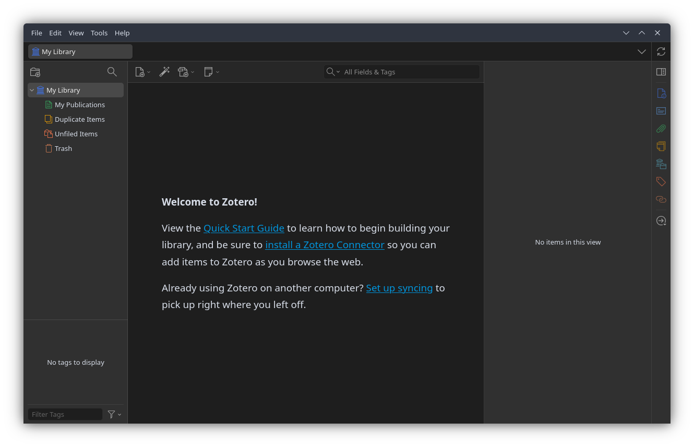

ここからは、最初にいくつかの設定をして、そのあと実際に文献を入れてみます。

#### 1. アカウント設定・同期
複数のPCで作業する可能性のある方や、共同研究で他の人と文献情報を共有する方は、アカウントを設定しておくとよいです。

画面の上部の編集 (Edit) タブから、設定 (Settings) を開きます。
なお、使用言語もここで選択できます。ご自由に。

同期 (Sync) の画面を開くと、アカウントを作成するためのリンクがあるので、そこをクリックしてアカウントを作成してください。
ユーザーネーム (メールアドレス) と、パスワードの設定を求められると思います。

アカウントが作成できたら、同期画面に情報を記入して、同期を開始してください。 

#### 2. Better BibTeX
$\LaTeX$ を使う人は、[Better BibTeX for Zotero](https://retorque.re/zotero-better-bibtex/) というプラグインを入れると幸せになれます。

まず、上記URLから Better BibTeX ページに移動します。
Installation なり Download から Github へ移動し、最新の XPI ファイルをダウンロードします。
続いて、Zotero の画面上部のツール (Tools) タブから、プラグイン (Plugins) を選択し、歯車マークをクリックして、「Install Plugin From File…」を選択します。
さきほど選択した XPI ファイルを選択すれば、プラグインを導入することができます。

## 文献を取り込む
ここからは、実際に文献を入れていきますが、その前に、試しにコレクションを作ってみます。
私はレポートや論文など一つのプロジェクトにつき1つのコレクションを作っています。
そうする必要はないのですが、なんとなく。

左上の「New Collection」アイコンをクリックして、適当なコレクションを作ります。
そうすると、「マイライブラリ / MyLibrary」の下に新しいフォルダができます。
今回は、「テスト」というコレクションを作ってみました。

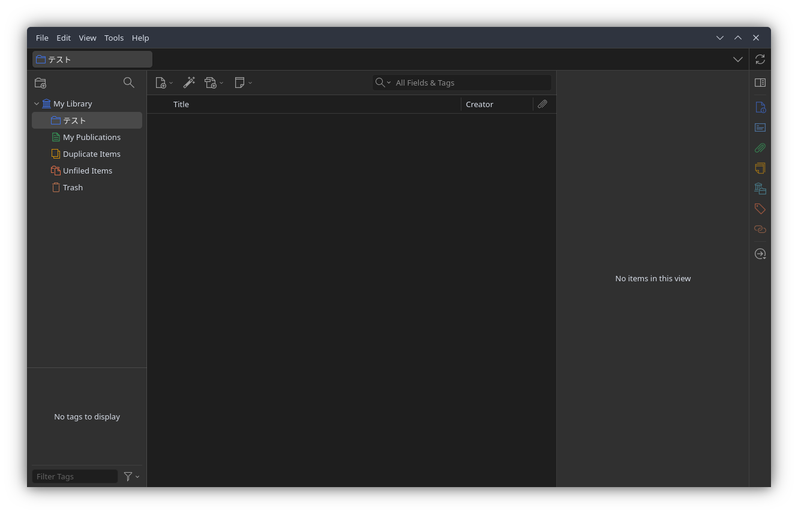

ここからの作業は、**Zotero でこのコレクションを開いた状態で**行います。
文献取り込みは、取り込みたいコレクションを開いた状態で取り込みを行うことに注意してください。

文献の取り込み方には、大きく5つあります。
個人的には、１番から順番に行っていくのがおすすめです。

1. 識別子 (DOI, ISBN) から取り込む
2. ブラウザから取り込む
3. PDF から取り込む
4. データベースから書誌情報を書き出して取り込む
5. 手入力する

### 識別子から取り込む
識別子とは、文献を識別するために付されている番号のことです。
Zotero は、[DOI](https://www.doi.org/) (Digital Object Identifier)、ISBN (International Standard Book Number)、[PubMed](https://pubmed.ncbi.nlm.nih.gov/) ID、[arXiv](https://arxiv.org/) ID に対応しています。

個人的には、識別子で取り込む方法が最も安定していると考えます。
ただし、論文 (doi が振られたもの) と書籍 (ISBN が振られたもの) に限定される点には注意が必要です。

#### 論文を取り込んでみる
試しに、[こちらのサイト](https://www.cambridge.org/core/journals/international-organization/article/abs/rationalist-explanations-for-war/E3B716A4034C11ECF8CE8732BC2F80DD)に載っている Fearon (1995) を取り込んでみます。

上記サイトから、文献の DOI をコピーします。
https:// から全部コピーしてもいいですし、10. からでも構いません。
先ほど作ったコレクションを開き、画面上部の魔法の杖みたいなアイコンをクリックします。
入力のフィールドが出るので、入力しエンターを押します。
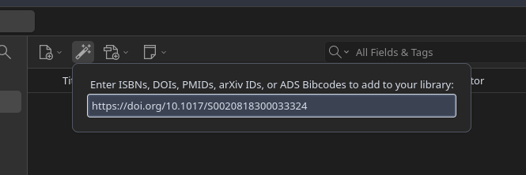

すると、写真のように、Fearon (1995) の情報 (タイトル、著者、雑誌など) が自動的に取り込まれています。
結構簡単ですね。
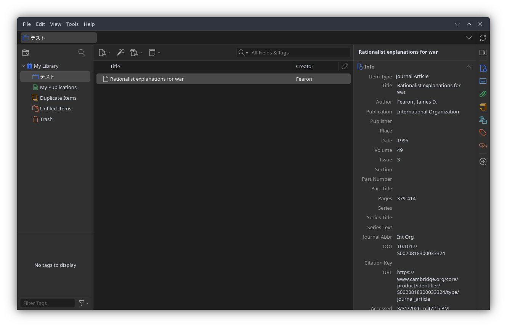

なお、論文の場合は PDF を持っており、それを添付したい場合があると思います。
オンライン上に PDF が公開されている場合は、PDFも自動的に取り込みます。
そうでない場合は、手動で添付する必要があります。

手動でファイルを追加するときは、論文のエントリを右クリックし、「Add Attachment」を選択します。

1. File 
    - PDF ファイルを直接添付する場合。Zotero のデータフォルダにコピーされるため、Zotero Sync で同期されます。
2. Linked File
    - コンピュータ上の PDF ファイルへのリンクだけを登録します。元のファイルを移動すると参照が切れるため注意。
3. Web Link
    - URL を登録する場合。論文のウェブページや、Google Drive、Dropbox 上のPDFファイルへのリンクを登録します。

特にこだわりがなければ、1番の方法で十分です。

#### 本を取り込んでみる
次に、[こちらのサイト](https://press.princeton.edu/books/hardcover/9780691224633/designing-social-inquiry?srsltid=AfmBOorAJU2UPJtVyjk6n7pSoEA4ZA6T-IPzN94BmP2LEFoV5VKQQuCK)に載っている、KKV を取り込んでみます。

同様に、本の ISBN[^isbn] をコピーします。
そして、画面上部の魔法の杖をクリックし、ISBNを入力してエンターを押します。
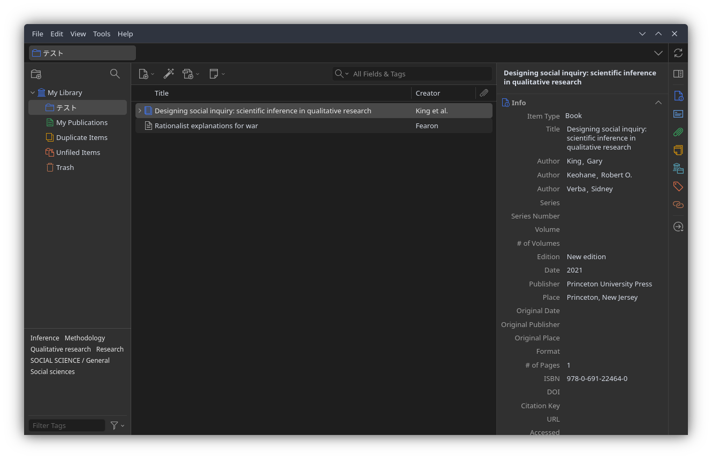

[^isbn]: ちなみに ISBN は、現在13桁のものが発行されていますが、以前は10桁でした。もちろん、どちらも正しく動作します。また、10桁と13桁がどちらも振られている場合もあり、この場合であっても、どちらを使っても同じ結果が得られます。

### Zotero Connector を使う
あなたが Firefox や Chrome などの標準的なブラウザを使っているなら、Zotero Connector という拡張機能を使うのが便利です。
これは、論文を掲載しているサイトから論文の情報 (可能なら PDF も) を自動的に取得してくれる機能です。

試しに、Powell (2006) の書誌情報が載っている[このサイト](https://www.cambridge.org/core/journals/international-organization/article/abs/war-as-a-commitment-problem/65DFFF1CD73A16F7ED4EEF6D4F934608) にアクセスしてみます。
サイトを開いた状態 (そして Zotero のコレクションも開いている状態) で、拡張機能を使ってみます。
Firefox なら、右上の拡張機能ボタンから Zotero Connector を選んで押します (その他は知りません、すみません)。
すると、それだけで書誌情報を手に入れることができました。

なお、大学の図書館等を経由し、論文 PDF を取得可能な画面で同じことをすると、PDF ごと手に入れることができます。
これにより、後から PDF を添付する必要もなくなります。
便利！

また、多くのウェブサイトも Zotero Connector を通して情報を取得することができます。
たとえば、UNDPの活動の成果が報告されている[こちらのサイト](https://www.undp.org/results) にアクセスした状態で Connector を使うと、以下のように情報を取得できます。
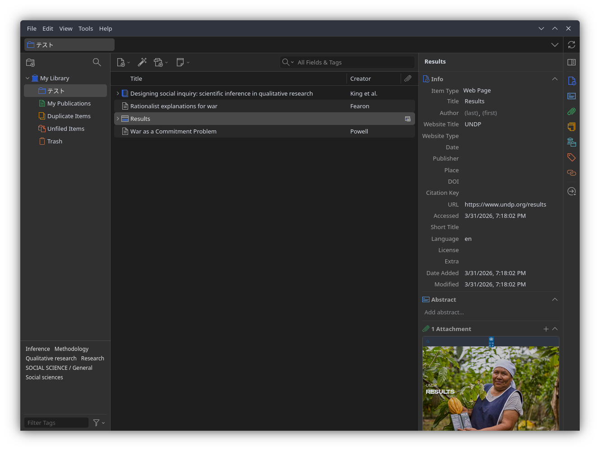

ただ、この情報はやや不正確です。
APA スタイルでは、公的な組織のウェブサイトを引用する際、著者の欄に具体的な Agency、わからなければ Organization の名前を書くこととされています ([APA style](https://apastyle.apa.org/style-grammar-guidelines/references/examples/report-government-agency-references))。

このような間違いは、手打ちで修正する必要があります。
特にウェブサイトや報告書などの場合は、手作業で情報を書き直すのが最も効率的だと思われます。

修正する場合は、右画面の情報をクリックすることで、直接手入力することができます。

### PDF から取り込む
Zotero は、PDF を直接ドラッグ & ドロップすることでも文献を取り込むことができます。

自身の PC に保存されている　PDF を、ファイルアプリから直接コレクションにドロップします。
しばらくすると、PDFが添付されたエントリが作成されるはずです。

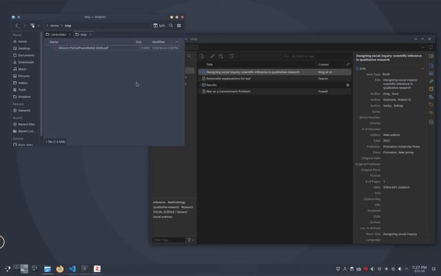

### データベースから書誌情報を書き出して取り込む
大学の図書館サイトや、Google Scholar、雑誌の出版社などのデータベースには、書誌情報をファイルとしてエクスポートする機能があることが多いです。
Zotero Connector がうまく動かないときや、検索結果から複数の文献をまとめて取り込みたいときに便利です。
ここでは、Google Scholar、Web of Science、大学図書館 (HERMES-Link) の3つのデータベースでの方法を説明します。

#### Google Scholar の場合
Google Scholar で検索したとき、各検索結果には「保存」「引用」……などの項目があります。
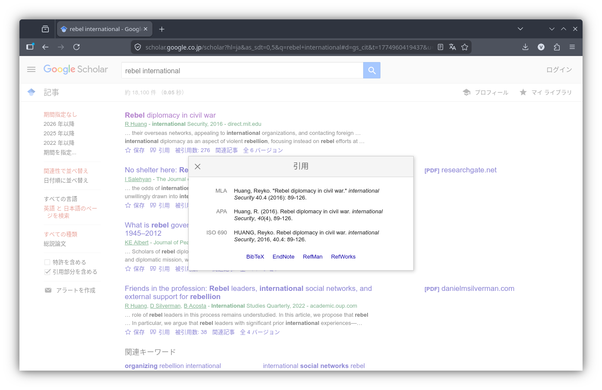

このうち、「引用」をクリックすると、主要なスタイルでの引用方法と、「BibTeX」「EndNote」「RefMan」「RefWorks」などの項目があります。
このうち「BibTeX」をクリックすると、書誌情報が書かれたファイルが表示されます。
これを保存し、Zotero の「ファイル (File)」→「インポート (Import)」で読み込むことで、文献情報を取り込むことができます。
なお他にも「EndNote」「RefMan」などのリンクがありますが、それぞれ別の文献管理ソフト向けの形式です。
Zotero はいずれの形式でも読み込めるので、どれを選んでも構いません。

#### Web of Science の場合
Web of Science は、複数の文献をまとめて取り込みたいときに非常に便利です。
Web of Science の検索の場合、検索結果の表示欄に「Export」のボタンが存在します。

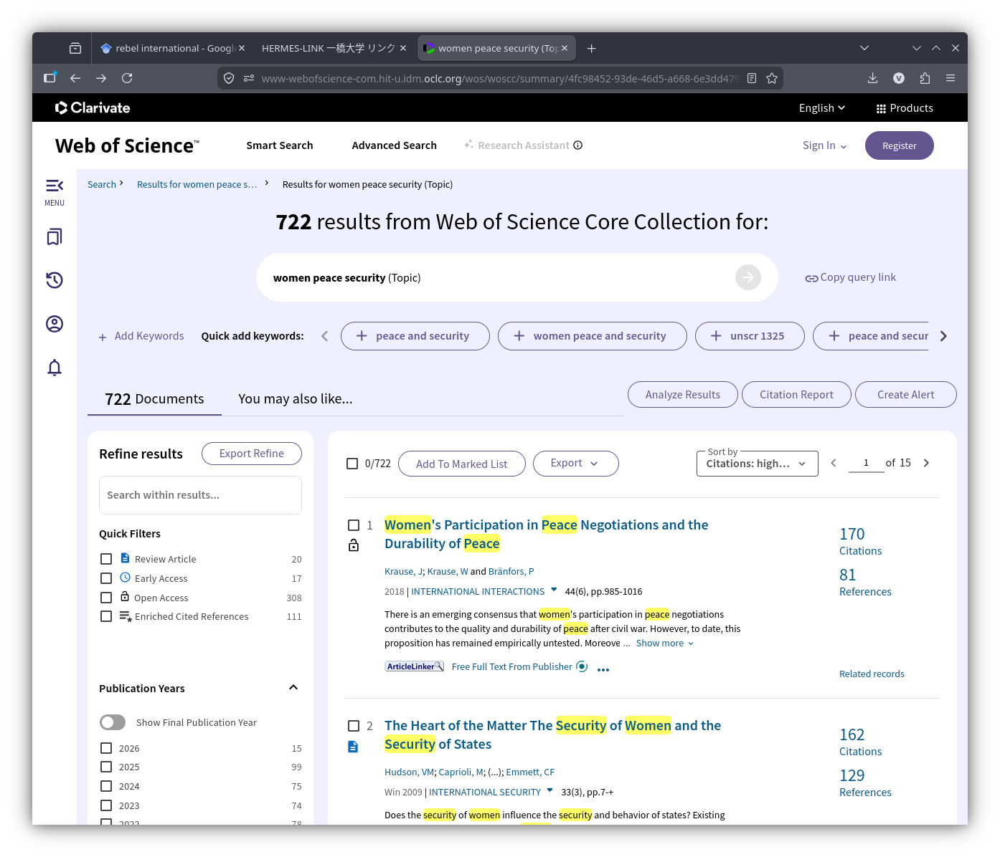

これをクリックし、「BibTeX」か「RIS」を選択します。
すると、エクスポートしたい文献の範囲を聞かれるので、「1ページ目のすべて (All records on page)」または「◯個めから◯個めまで (Records from:)」を選択します。
また、Record Content には、こだわりがなければ Full Record を選択します。
そのうえで Export をクリックすると、範囲のすべての文献情報が記載されたファイルが手に入ります。
あとは同様に、Zotero の「ファイル (File)」→「インポート (Import)」で読み込みます。

#### 大学図書館の場合
大学附属図書館には、文献の所蔵状況やデータベースへのリンクなどを確認するデータベースサイトがあります。
一橋大学附属図書館の場合は、「HERMES-Link」がこれに当たります。
ここには、情報のエクスポートのボタンがあります。
これをクリックし、「EndNote、ProCite、または　Reference Manager に直接」または「RIS形式で」どちらかを選択すると、文献情報がファイルとしてエクスポートされます。
あとは同様に、Zotero の「ファイル (File)」→「インポート (Import)」で読み込みます。

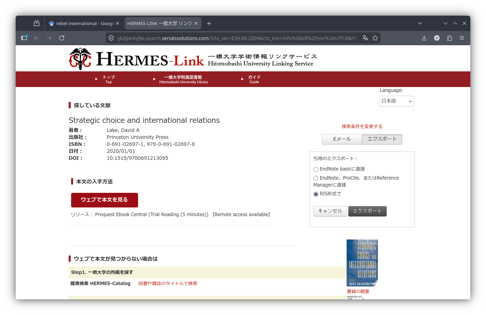

### 手入力で取り込む
これまでに説明したいずれの方法でも取り込めない場合は、手動で入力します。
古い資料や未公刊の報告書、一部のウェブページなど、識別子ではうまく取り込めない場合は、意外とよくあります。
また、編集された本の中の1章 (Book Section) のような場合は、固有の識別子が振られておらず、手入力することが多いです。

画面上部の New Item アイコンをクリックすると、文献の種類を選ぶメニューが現れます。
「Journal Article（学術論文）」「Book（書籍）」「Report（報告書）」「Web Page（ウェブページ）」など、適切なものを選びます。
すると、右側のパネルに空の入力欄が表示されるので、タイトル、著者、出版年などを一つずつ入力していきます。

例えば、ある本のある章を登録するときは次のような画面になります。
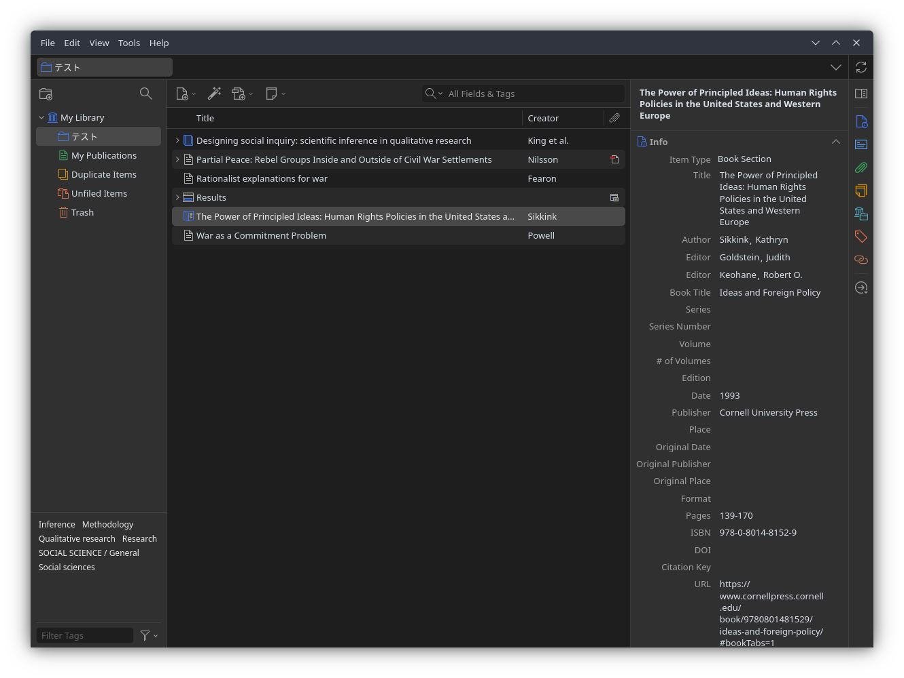

ちなみに、著者を追加するときは、著者の右にあるプラスボタンを押します。
また、著者や編集者を変えるときは、「Author」という表示をクリックすると、選べるようになります。

このとき、いくつか注意点があります。

- 文献の種類 (Item Type) を正しく選ぶこと
    - 引用時の表記がおかしくなります。
- 著者名の姓名を正しく分けること
    - 入力欄の横にある切り替えボタンで、分割モードと一行入力モードを切り替えることもできます。
- できるだけ多くの情報をいれること
    - 後から引用スタイルを変えたとき、情報が足りないと正しく出力されません。

## 取り込んだ文献を整理する
文献をいくつか取り込んだら、整理しておくと後が楽です。
ここでは、3つの整理機能を紹介します。

### コレクション
先ほど作った「テスト」のようなフォルダです。
プロジェクトごと、授業ごとなど、自分が使いやすい単位で作ります。

一つの文献を複数のコレクションに入れることもできます。
コレクション間でドラッグ＆ドロップするだけです。
このとき、文献データがコピーされるのではなく、同じデータへの参照が増えるだけなので、重複の心配はありません。

### タグ
文献にラベルを貼る機能です。
たとえば「要読了」「重要」「方法論」のようなタグを付けておくと、後から絞り込むときに便利です。
右側のパネルの「タグ (Tags)」タブから追加できます。

なお、データベースから取り込んだ文献には、自動的にタグが付いていることがあります（キーワードなど）。
先ほどの画面の左下にも、いくつかのタグが表示されていたと思います。
不要であれば削除しても構いません。

### 関連アイテム
「この文献とこの文献は関連がある」というつながりを記録する機能です。
右側パネルの「関連 (Related)」タブから設定します。

正直なところ、私自身はあまり使っていませんが、「この論文はあの論文への反論だ」のような関係を記録しておきたい人には便利だと思います。

## まとめ
この記事では、Zotero のインストールから、文献の取り込み、整理までを紹介しました。
取り込み方法をまとめると、以下のようになります。

::: {.aligned-list}
| 方法 | 手軽さ | 正確さ | 備考 |
|-------|---|---|---------|
| 識別子 (DOI/ISBN) | ◎ | ◎ | 最も安定。DOI/ISBN がある文献向け |
| Zotero Connector | ◎ | ○ | ワンクリックで楽。サイトによっては不正確 |
| PDF ドラッグ＆ドロップ | ○ | △〜○ | 手元に PDF があるとき。精度はまちまち |
| データベースからエクスポート | △ | ○ | Connector が使えないときの代替手段 |
| 手入力 | × | — | 最終手段。Book Section 等では避けられない |
:::

おすすめは、識別子（DOI / ISBN）での取り込みを基本にしつつ、Connector も併用することです。
うまくいかないときに、他の方法を使います。

いずれの方法でも大切なのは、取り込んだ後に書誌情報が正しいか確認することです。
自動取り込みは便利ですが、万能ではありません。
特に著者名、出版年、文献の種類 (Item Type) が間違っていると、引用時に困ります。

次回の記事では、取り込んだ文献を実際に論文で引用し、参考文献リストを自動的に作成する方法を説明します。